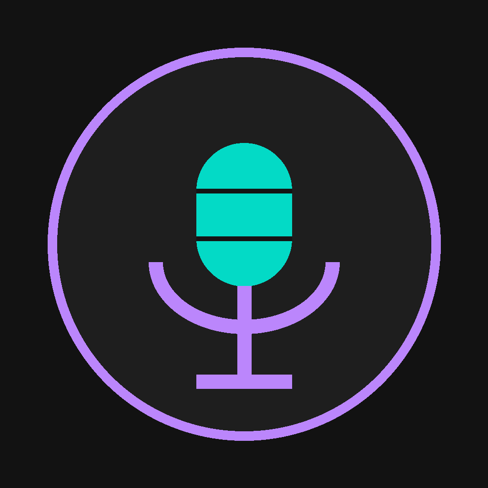

<p align="center">
  
</p>

<h1 align="center">NDI Shure Monitor</h1>

<p align="center">
  Broadcast wireless mic mute statuses as an NDI video feed —<br>
  Shure TCP · Behringer X32 · Behringer WING
</p>

<p align="center">
  <a href="https://github.com/maglite4cell/NDI-Mic-Mute-Monitor/actions/workflows/ci.yml">
    
  </a>
  <a href="https://github.com/maglite4cell/NDI-Mic-Mute-Monitor/actions/workflows/build-release.yml">
    
  </a>
  <a href="https://maglite4cell.github.io/NDI-Mic-Mute-Monitor/">
    
  </a>
  <a href="https://github.com/maglite4cell/NDI-Mic-Mute-Monitor/releases">
    
  </a>
</p>

---

A standalone service and visual dashboard that monitors Shure wireless microphones and Behringer mixer channel states, broadcasting their statuses as an NDI video feed for live broadcast overlays.

📖 **[Full Documentation →](https://maglite4cell.github.io/NDI-Mic-Mute-Monitor/)**

---

💖 **Support this project!**  
If this tool has saved your Sunday service, corporate broadcast, or live gig, consider sponsoring the development!  
**[Sponsor @maglite4cell on GitHub Sponsors](https://github.com/sponsors/maglite4cell)**

---

## Features

- 🎙️ **Shure wireless** — real-time mute, battery, and RF status over TCP (port 2202)
- 🎛️ **Behringer X32 & WING** — mute tracking via live OSC subscription
- 📡 **NDI output** — broadcast directly into OBS, vMix, or hardware NDI switchers
- 🖥️ **Web dashboard** — configure at `http://localhost:8001`, live, no restart needed
- ⚡ **Lightweight** — single process, no GPU required for NDI output

## Quick Start

### Pre-built Binary (Recommended)

Download the latest `.app` (macOS) or `.exe` (Windows) from the [Releases](https://github.com/maglite4cell/NDI-Mic-Mute-Monitor/releases) page.

> [!IMPORTANT]
> **macOS — Gatekeeper bypass:** Because this app is not notarized, run this once in Terminal before launching:
> ```bash
> xattr -cr "/Applications/NDI Shure Monitor.app"
> ```
> *(Tip: drag the app into Terminal after `xattr -cr ` to auto-fill the path.)*

### Running from Source

```bash
git clone https://github.com/maglite4cell/NDI-Mic-Mute-Monitor.git
cd NDI-Mic-Mute-Monitor

uv sync              # core dependencies
uv sync --all-extras # include NDI output (requires NDI SDK)
uv run python main.py
```

> [!NOTE]
> Without the NDI SDK, the app starts in **mock mode** — the dashboard and all monitors work, but no NDI feed is broadcast.

## NDI Runtime

Required on any machine that will send or receive the NDI feed:

> **[Download NDI Tools](https://ndi.video/tools/)** (free) from ndi.video

## Supported Hardware

| Protocol | Hardware | Port |
|---|---|---|
| Shure TCP | QLX-D, ULX-D, SLX-D, Axient Digital | 2202 |
| OSC | Behringer X32 / X32 Rack / Compact | 10023 |
| OSC | Behringer WING / WING Rack | 2223 |

For full compatibility details, transmitter support, and SLX-D setup notes, see the **[Protocols documentation](https://maglite4cell.github.io/NDI-Mic-Mute-Monitor/protocols/)**.

## Configuration

Open `http://localhost:8001` in your browser to configure channel slots, IP addresses, layout modes, and display options — live, without restarting.

All settings are persisted in `config.json`:
- **macOS (bundled):** `~/Library/Application Support/NDI Shure Monitor/config.json`
- **Windows (bundled):** `%APPDATA%\NDI Shure Monitor\config.json`

Full configuration reference: **[Configuration documentation](https://maglite4cell.github.io/NDI-Mic-Mute-Monitor/configuration/)**

## Building

Binaries are automatically built for macOS and Windows via GitHub Actions on each tagged release. To build locally:

```bash
uv run --with pyinstaller pyinstaller NDI_Shure_Monitor.spec
```

## License

MIT License. See [LICENSE](LICENSE).  
NDI® is a registered trademark of Vizrt Group. Bundled NDI runtime libraries are subject to the [NDI SDK License Agreement](https://ndi.video/legal/).
